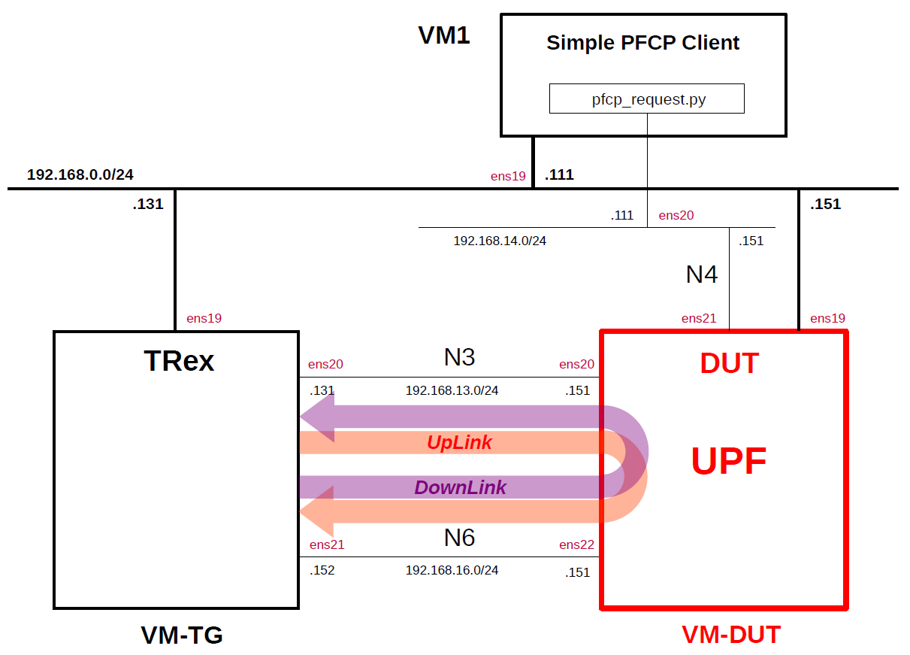

# Simple Measurement of UPF Performance 9
This describes simple performance measurements of several open source UPFs by using the traffic generator [TRex](https://github.com/cisco-system-traffic-generator/trex-core) as the performance measurement tool and [Simple PFCP Client](https://github.com/s5uishida/simple_pfcp_client) as the PFCP simulator.
This was measured on the VMs on Proxmox VE.
For other measurement results, please see [Performance Measurement](https://github.com/s5uishida/sample_config_misc_for_mobile_network#performance_measurement).

**Note. Performance measurement results are highly dependent on the measurement conditions. These results are only examples of results under certain measurement conditions.
And this is a very simple measurement, and according to [this comment](https://github.com/open5gs/open5gs/discussions/1780#discussioncomment-10853290), it doesn't seem to make much sense to measure between VMs. I hope it will serve as a reference for a simple configuration when measuring on real devices.**

---

### [Sample Configurations and Miscellaneous for Mobile Network](https://github.com/s5uishida/sample_config_misc_for_mobile_network)

---

<a id="toc"></a>

## Table of Contents

- [Simple Overview of UPF Performance Measurements](#overview)
- [Changes in configuration files of Simple PFCP Client, TRex and UPFs](#changes)
  - [Changes in configuration files of Simple PFCP Client](#changes_pfcp)
  - [Changes in configuration files of TRex](#changes_trex)
  - [Changes in configuration files of UPFs](#changes_up)
    - [a-1. Changes in configuration files of Open5GS 5GC UPF (TUN)](#changes_up_a1)
    - [a-2. Changes in configuration files of Open5GS 5GC UPF (TAP)](#changes_up_a2)
    - [b. Changes in configuration files of free5GC 5GC UPF](#changes_up_b)
    - [c. Changes in configuration files of UPG-VPP](#changes_up_c)
    - [d. Changes in configuration files of eUPF](#changes_up_d)
- [Network settings of TRex and UPFs](#network_settings)
  - [Network settings of TRex](#network_settings_trex)
  - [a-1. Network settings of Open5GS 5GC UPF (TUN)](#network_settings_up_a1)
  - [a-2. Network settings of Open5GS 5GC UPF (TAP)](#network_settings_up_a2)
  - [b. Network settings of free5GC 5GC UPF](#network_settings_up_b)
  - [c. Network settings of UPG-VPP](#network_settings_up_c)
  - [d. Network settings of eUPF](#network_settings_up_d)
- [Build Simple PFCP Client, TRex and UPFs](#build)
- [Run Simple PFCP Client, TRex and UPFs](#run)
  - [Run UPFs](#run_up)
    - [a-1. Run Open5GS 5GC UPF (TUN)](#run_up_a1)
    - [a-2. Run Open5GS 5GC UPF (TAP)](#run_up_a2)
    - [b. Run free5GC 5GC UPF](#run_up_b)
    - [c. Run UPG-VPP](#run_up_c)
    - [d. Run eUPF](#run_up_d)
  - [Run Simple PFCP Client](#run_pfcp)
  - [Run TRex](#run_trex)
- [Measure UPF Performance](#measure)
- [Results](#results)
  - [Load measurement](#load_measurement)
  - [Latency measurement](#latency_measurement)
  - [Summary](#summary)
  - [Performance of N6 interface only](#n6_performance)
- [Changelog (summary)](#changelog)

---

<a id="overview"></a>

## Simple Overview of UPF Performance Measurements

I will easily measure the performance of several open source UPFs by using TRex as the traffic generator and Simple PFCP Client as the PFCP simulator.
**Note that this configuration is implemented with Proxmox VE VMs.**

The following minimum configuration was set as a condition.
- One PFCP client, TRex and DUT (UPF)

The built simulation environment is as follows.

</img>

Simple PFCP Client, TRex used are as follows.
- Simple PFCP Client (2025.01.16) - https://github.com/s5uishida/simple_pfcp_client
- TRex v3.06 (2024.09.17) - https://github.com/cisco-system-traffic-generator/trex-core
- Scapy v2.6.1 (2024.11.05) - https://github.com/secdev/scapy

The UPFs used are as follows.
- Open5GS v2.7.5 (2025.06.01) - https://github.com/open5gs/open5gs
- free5GC UPF (go-upf) v1.2.6 (2025.03.03) - https://github.com/free5gc/go-upf  
  gtp5g v0.9.14 (2025.04.21) - https://github.com/free5gc/gtp5g
- UPG-VPP v1.13.0 (2024.03.25) - https://github.com/travelping/upg-vpp
- eUPF v0.7.1 (2025.06.04) - https://github.com/edgecomllc/eupf

Each VMs are as follows.  
| VM | SW & Role | IP address | OS | CPU | Mem | HDD |
| --- | --- | --- | --- | --- | --- | --- |
| VM1 | Simple PFCP Client | 192.168.0.111/24 | Ubuntu 24.04 | 1 | 1GB | 10GB |
| VM-TG | TRex<br>Traffic Generator | 192.168.0.131/24 | Ubuntu 22.04 | 3 | 8GB | 20GB |
| **VM-DUT** | **each UPF DUT<br>(Device Under Test)** | **192.168.0.151/24** | **Ubuntu 24.04<br>or 22.04** | **2** | **8GB** | **20GB** |

**Each VM-DUT(UPFs) are as follows.**
| # | SW / *packet processing* | Date | Commit | OS |
| --- | --- | --- | --- | --- |
| a | Open5GS UPF v2.7.5<br>***user space*** | 2025.06.01 | `9f5d133657850e6167231527514ee1364d37a884` | Ubuntu 24.04 |
| b | free5GC UPF<br>(go-upf) v1.2.6<br>***kernel module*** | 2025.03.03 | `07801dcf3cfd0516610aae3fa08809cfd0b2497f` | Ubuntu 24.04 |
| c | UPG-VPP v1.13.0<br>***VPP/DPDK*** | 2024.03.25 | `dfdf64000566d35955d7c180720ff66086bd3572` | Ubuntu 22.04 |
| d | eUPF v0.7.1<br>***eBPF/XDP*** | 2025.06.04 | `5653b09a97db9b38e7a03d118649d38f4e95d7a2` | Ubuntu 24.04 |

The network interfaces of each VM except VM-DUT are as follows.
| VM | Device | Model | Linux Bridge | IP address | Interface |
| --- | --- | --- | --- | --- | --- |
| VM1 | ens18 | VirtIO | vmbr1 | 10.0.0.111/24 | (NAPT NW) |
| | ens19 | VirtIO | mgbr0 | 192.168.0.111/24 | (Mgmt NW) |
| | ens20 | VirtIO | vmbr4 | 192.168.14.111/24 | N4 |
| VM-TG | ens18 | VirtIO | vmbr1 | 10.0.0.131/24 | (NAPT NW) |
| | ens19 | VirtIO | mgbr0 | 192.168.0.131/24 | (Mgmt NW) |
| | ens20 | VirtIO | vmbr3 | 192.168.13.131/24 | N3 ***(Under DPDK by uio_pci_generic)*** |
| | ens21 | VirtIO | vmbr6 | 192.168.16.152/24 | N6 ***(Under DPDK by uio_pci_generic)*** |

**The network interfaces of each VM-DUT(UPFs) are as follows.**
| # | SW | Device | Model | Linux Bridge | IP address | Interface |
| --- | --- | --- | --- | --- | --- | --- |
| a | Open5GS UPF | ~~ens18~~ | ~~VirtIO~~ | ~~vmbr1~~ | ~~10.0.0.151/24~~ | ~~(NAPT NW)~~ ***down*** |
| | | ens19 | VirtIO | mgbr0 | 192.168.0.151/24 | (Mgmt NW) |
| | | ens20 | VirtIO | vmbr3 | 192.168.13.151/24 | N3 |
| | | ens21 | VirtIO | vmbr4 | 192.168.14.151/24 | N4 |
| | | ens22 | VirtIO | vmbr6 | 192.168.16.151/24 | N6 |
| b | free5GC UPF<br>(go-upf) | ~~ens18~~ | ~~VirtIO~~ | ~~vmbr1~~ | ~~10.0.0.151/24~~ | ~~(NAPT NW)~~ ***down*** |
| | | ens19 | VirtIO | mgbr0 | 192.168.0.151/24 | (Mgmt NW) |
| | | ens20 | VirtIO | vmbr3 | 192.168.13.151/24 | N3 |
| | | ens21 | VirtIO | vmbr4 | 192.168.14.151/24 | N4 |
| | | ens22 | VirtIO | vmbr6 | 192.168.16.151/24 | N6 |
| c | UPG-VPP | ~~ens18~~ | ~~VirtIO~~ | ~~vmbr1~~ | ~~10.0.0.151/24~~ | ~~(NAPT NW)~~ ***down*** |
| | | ens19 | VirtIO | mgbr0 | 192.168.0.151/24 | (Mgmt NW) |
| | | ens20 | VirtIO | vmbr3 | 192.168.13.151/24 | N3 ***(Under DPDK by vfio-pci)*** |
| | | ens21 | VirtIO | vmbr4 | 192.168.14.151/24 | N4 ***(Under DPDK by vfio-pci)*** |
| | | ens22 | VirtIO | vmbr6 | 192.168.16.151/24 | N6 ***(Under DPDK by vfio-pci)*** |
| d | eUPF | ~~ens18~~ | ~~VirtIO~~ | ~~vmbr1~~ | ~~10.0.0.151/24~~ | ~~(NAPT NW)~~ ***down*** |
| | | ens19 | VirtIO | mgbr0 | 192.168.0.151/24 | (Mgmt NW) |
| | | ens20 | VirtIO | vmbr3 | 192.168.13.151/24 | N3 ***(XDP)*** |
| | | ens21 | VirtIO | vmbr4 | 192.168.14.151/24 | N4 |
| | | ens22 | VirtIO | vmbr6 | 192.168.16.151/24 | N6 ***(XDP)*** |

Linux Bridges of Proxmox VE are as follows.
| Linux Bridge | Network CIDR | Interface |
| --- | --- | --- |
| vmbr1 | 10.0.0.0/24 | NAPT NW |
| mgbr0 | 192.168.0.0/24 | Mgmt NW |
| vmbr3 | 192.168.13.0/24 | N3 |
| vmbr4 | 192.168.14.0/24 | N4 |
| vmbr6 | 192.168.16.0/24 | N6 |

UE IP address and TEID are as follows.
| UE IP address | UpLink TEID | DownLink TEID |
| --- | --- | --- |
| 10.45.0.2/24 | 0x00000001 | 0x00000002 |

<a id="changes"></a>

## Changes in configuration files of Simple PFCP Client, TRex and UPFs

Please refer to the following for building Simple PFCP Client, TRex and UPFs respectively.
- Simple PFCP Client (2025.01.16) - https://github.com/s5uishida/simple_pfcp_client
- TRex v3.06 (2024.09.17) - https://github.com/s5uishida/install_trex
- Open5GS v2.7.5 (2025.06.01) - https://open5gs.org/open5gs/docs/guide/02-building-open5gs-from-sources/
- free5GC UPF (go-upf) v1.2.6 (2025.03.03) - https://free5gc.org/guide/
- UPG-VPP v1.13.0 (2024.03.25) - https://github.com/s5uishida/install_vpp_upf_dpdk
- eUPF v0.7.1 (2025.06.04) - https://github.com/s5uishida/install_eupf

<a id="changes_pfcp"></a>

### Changes in configuration files of Simple PFCP Client

See [here](https://github.com/s5uishida/simple_pfcp_client#set_param) for the original file.

- `/root/pfcp_request.py`  
There is no change.

<a id="changes_trex"></a>

### Changes in configuration files of TRex

See [here](https://github.com/s5uishida/install_trex#config) for the original file.

- `/etc/trex_cfg.yaml`  
There is no change.

See [here](https://github.com/s5uishida/install_trex#load_profile) for the original load profiles.

- `/opt/trex/stl/gtp_1pkt_simple.py` for UpLink  
There is no change.

- `/opt/trex/stl/udp_1pkt_simple.py` for DownLink  
There is no change.

See [here](https://github.com/s5uishida/install_trex#latency_profile) for the original latency profiles.

- `/opt/trex/stl/gtp_latency_1pkt_simple.py` for UpLink  
There is no change.

- `/opt/trex/stl/udp_latency_1pkt_simple.py` for DownLink  
There is no change.

<a id="changes_up"></a>

### Changes in configuration files of UPFs

<a id="changes_up_a1"></a>

#### a-1. Changes in configuration files of Open5GS 5GC UPF (TUN)

- `open5gs/install/etc/open5gs/upf.yaml`
```diff
--- upf.yaml.orig       2024-05-02 19:52:00.000000000 +0900
+++ upf.yaml        2024-05-19 12:38:00.000000000 +0900
@@ -11,18 +11,18 @@
 upf:
   pfcp:
     server:
-      - address: 127.0.0.7
+      - address: 192.168.14.151
     client:
 #      smf:     #  UPF PFCP Client try to associate SMF PFCP Server
 #        - address: 127.0.0.4
   gtpu:
     server:
-      - address: 127.0.0.7
+      - address: 192.168.13.151
   session:
     - subnet: 10.45.0.0/16
       gateway: 10.45.0.1
-    - subnet: 2001:db8:cafe::/48
-      gateway: 2001:db8:cafe::1
+      dnn: internet
+      dev: ogstun
   metrics:
     server:
       - address: 127.0.0.7
```

<a id="changes_up_a2"></a>

#### a-2. Changes in configuration files of Open5GS 5GC UPF (TAP)

- `open5gs/install/etc/open5gs/upf.yaml`
```diff
--- upf.yaml.orig       2024-05-02 19:52:00.000000000 +0900
+++ upf.yaml        2024-09-23 14:00:20.724467385 +0900
@@ -11,18 +11,18 @@
 upf:
   pfcp:
     server:
-      - address: 127.0.0.7
+      - address: 192.168.14.151
     client:
 #      smf:     #  UPF PFCP Client try to associate SMF PFCP Server
 #        - address: 127.0.0.4
   gtpu:
     server:
-      - address: 127.0.0.7
+      - address: 192.168.13.151
   session:
     - subnet: 10.45.0.0/16
       gateway: 10.45.0.1
-    - subnet: 2001:db8:cafe::/48
-      gateway: 2001:db8:cafe::1
+      dnn: internet
+      dev: ogstap
   metrics:
     server:
       - address: 127.0.0.7
```

<a id="changes_up_b"></a>

#### b. Changes in configuration files of free5GC 5GC UPF

- `go-upf/upfcfg.yaml`
```diff
--- upfcfg.yaml.orig    2024-10-14 04:53:12.341028732 +0900
+++ upfcfg.yaml 2024-10-14 06:11:36.636303534 +0900
@@ -4,8 +4,8 @@
 # PFCP Configuration
 # The listen IP and nodeID of the N4 interface on this UPF (Can't set to 0.0.0.0)
 pfcp:
-  addr: 127.0.0.8   # IP addr for listening
-  nodeID: 127.0.0.8 # External IP or FQDN can be reached
+  addr: 192.168.14.151   # IP addr for listening
+  nodeID: 192.168.14.151 # External IP or FQDN can be reached
   retransTimeout: 1s # retransmission timeout
   maxRetrans: 3 # the max number of retransmission
 
@@ -18,7 +18,7 @@
   # If you bind to a specific IP, ensure SMF uses the same IP in its N3 configuration.
   # If you bind to all (0.0.0.0), SMF can use any of the available UPF IPs, but do not use 0.0.0.0 in SMF.
   ifList:
-    - addr: 127.0.0.8
+    - addr: 192.168.13.151
       type: N3
       # name: upf.5gc.nctu.me
       # ifname: gtpif
@@ -28,9 +28,7 @@
 # List of Data Network Names (DNN) supported by this UPF.
 dnnList:
   - dnn: internet # Data Network Name
-    cidr: 10.60.0.0/16 # Classless Inter-Domain Routing for assigned IPv4 pool of UE
-  - dnn: internet # Data Network Name
-    cidr: 10.61.0.0/16 # Classless Inter-Domain Routing for assigned IPv4 pool of UE
+    cidr: 10.45.0.0/16 # Classless Inter-Domain Routing for assigned IPv4 pool of UE
     # natifname: eth0
 
 # Logging Configuration
```

<a id="changes_up_c"></a>

#### c. Changes in configuration files of UPG-VPP

See [here](https://github.com/s5uishida/install_vpp_upf_dpdk#conf) for the original files.

- `upg-vpp/startup.conf`  
There is no change.

- `upg-vpp/init.conf`  
There is no change.

<a id="changes_up_d"></a>

#### d. Changes in configuration files of eUPF

See [here](https://github.com/s5uishida/install_eupf#create-configuration-file) for the original file.

- `eupf/config.yml`  
There is no change.

<a id="network_settings"></a>

## Network settings of TRex and UPFs

<a id="network_settings_trex"></a>

### Network settings of TRex

Set the OS kernel parameter according to [this](https://github.com/s5uishida/install_trex#set_param).

<a id="network_settings_up_a1"></a>

### a-1. Network settings of Open5GS 5GC UPF (TUN)

First, uncomment the next line in the `/etc/sysctl.conf` file and reflect it in the OS.
```
net.ipv4.ip_forward=1
```
```
# sysctl -p
```
Next, down the interface `ens18` of the VM-DUT to delete default GW.
```
# ip link set dev ens18 down
```
Then, configure the TUNnel interface.
```
# ip tuntap add name ogstun mode tun
# ip addr add 10.45.0.1/16 dev ogstun
# ip link set ogstun up
```

<a id="network_settings_up_a2"></a>

### a-2. Network settings of Open5GS 5GC UPF (TAP)

First, uncomment the next line in the `/etc/sysctl.conf` file and reflect it in the OS.
```
net.ipv4.ip_forward=1
```
```
# sysctl -p
```
Next, down the interface `ens18` of the VM-DUT to delete default GW.
```
# ip link set dev ens18 down
```
Then, configure the TAP interface.
```
# ip tuntap add name ogstap mode tap
# ip addr add 10.45.0.1/16 dev ogstap
# ip link set ogstap up
```

<a id="network_settings_up_b"></a>

### b. Network settings of free5GC 5GC UPF

First, uncomment the next line in the `/etc/sysctl.conf` file and reflect it in the OS.
```
net.ipv4.ip_forward=1
```
```
# sysctl -p
```
Next, down the interface `ens18` of the VM-DUT to delete default GW.
```
# ip link set dev ens18 down
```

<a id="network_settings_up_c"></a>

### c. Network settings of UPG-VPP

See [this](https://github.com/s5uishida/install_vpp_upf_dpdk#setup_up).

<a id="network_settings_up_d"></a>

### d. Network settings of eUPF

First, uncomment the next line in the `/etc/sysctl.conf` file and reflect it in the OS.
```
net.ipv4.ip_forward=1
```
```
# sysctl -p
```
Next, down the interface `ens18` of the VM-DUT to delete default GW.
```
# ip link set dev ens18 down
```

<a id="build"></a>

## Build Simple PFCP Client, TRex and UPFs

Please refer to the following for building Simple PFCP Client, TRex and UPFs respectively.
- Simple PFCP Client (2025.01.16) - https://github.com/s5uishida/simple_pfcp_client
- TRex v3.06 (2024.09.17) - https://github.com/s5uishida/install_trex
- Open5GS v2.7.5 (2025.06.01) - https://open5gs.org/open5gs/docs/guide/02-building-open5gs-from-sources/
- free5GC UPF (go-upf) v1.2.6 (2025.03.03) - https://github.com/s5uishida/install_goupf
- UPG-VPP v1.13.0 (2024.03.25) - https://github.com/s5uishida/install_vpp_upf_dpdk
- eUPF v0.7.1 (2025.06.04) - https://github.com/s5uishida/install_eupf

<a id="run"></a>

## Run Simple PFCP Client, TRex and UPFs

First run each UPF, then Simple PFCP Client and TRex last.
Each UPF uses the same IP address, so start only the UPF you want to measure.

<a id="run_up"></a>

### Run UPFs

<a id="run_up_a1"></a>

#### a-1. Run Open5GS 5GC UPF (TUN)

Please use the configuration files changed for TUN interface.
```
# cd open5gs
# ./install/bin/open5gs-upfd
```

<a id="run_up_a2"></a>

#### a-2. Run Open5GS 5GC UPF (TAP)

Please use the configuration files changed for TAP interface.
```
# cd open5gs
# ./install/bin/open5gs-upfd
```

<a id="run_up_b"></a>

#### b. Run free5GC 5GC UPF

```
# cd go-upf
# ./upf -c upfcfg.yaml
```

<a id="run_up_c"></a>

#### c. Run UPG-VPP

See [this](https://github.com/s5uishida/install_vpp_upf_dpdk#run).

<a id="run_up_d"></a>

#### d. Run eUPF

See [this](https://github.com/s5uishida/install_eupf#run).

<a id="run_pfcp"></a>

### Run Simple PFCP Client

See [this](https://github.com/s5uishida/simple_pfcp_client#run).

<a id="run_trex"></a>

### Run TRex

Please refer to [this](https://github.com/s5uishida/install_trex#run) to run TRex.

<a id="measure"></a>

## Measure UPF Performance

Please see below for methods for measuring UpLink and DownLink performances.
- [UpLink measurement](https://github.com/s5uishida/install_trex#ul_measurement)
- [DownLink measurement](https://github.com/s5uishida/install_trex#dl_measurement)

<a id="results"></a>

## Results

In this measurement, the UDP payload size is set to 1400 bytes.

<a id="load_measurement"></a>

### Load measurement

| # | UPF / Date | UpLink<br>Gbps | <br>Kpps | <br>CPU%[1] | DownLink<br>Gbps | <br>Kpps | <br>CPU%[1] |
| --- | --- | --- | --- | --- | --- | --- | --- |
| a-1 | Open5GS UPF v2.7.5 (TUN)<br>2025.06.01 | Tx:1.79<br>Rx:1.25 | Tx:150.04<br>Rx:107.98 | 1.8 | Tx:1.73<br>Rx:1.19 | Tx:149.44<br>Rx:100.23 | 2.19 |
| a-2 | Open5GS UPF v2.7.5 (TAP)<br>2025.06.01 | Tx:1.79<br>Rx:1.2 | Tx:150.33<br>Rx:104.09 | 1.71 | Tx:1.74<br>Rx:1.21 | Tx:150.01<br>Rx:102.41 | 2.18 |
| b | free5GC UPF v1.2.6<br>2025.03.03 | Tx:5.95<br>Rx:4.88 | Tx:499.54<br>Rx:421.81 | 6.77 | Tx:5.77<br>Rx:3.74 | Tx:499.11<br>Rx:314.66 | 5.09 |
| c | UPG-VPP v1.13.0<br>2024.03.25 | Tx:10.45<br>Rx:7.41 | Tx:876.64<br>Rx:640.52 | 11.66 | Tx:10.25<br>Rx:7.51 | Tx:886.43<br>Rx:632.63 | 11.29 |
| d | eUPF v0.7.1 (native mode)<br>2025.06.04 | Tx:11.62<br>Rx:9.57 | Tx:975.05<br>Rx:827.04 | 35.88 | Tx:11.24<br>Rx:9.58 | Tx:972.01<br>Rx:803.92 | 52.83 |

1. CPU load - per core of TRex VM (VM-TG). In this case only one core is used.

<details><summary>a-1. logs for Open5GS UPF v2.7.5 (TUN)</summary>

**UpLink measurement**
```
start -f stl/gtp_1pkt_simple.py -p 0 -m 150kpps -d 60
```
```
Global Statistics

connection   : localhost, Port 4501                       total_tx_L2  : 1.79 Gbps
version      : STL @ v3.06                                total_tx_L1  : 1.81 Gbps
cpu_util.    : 1.8% @ 1 cores (1 per dual port)           total_rx     : 1.25 Gbps
rx_cpu_util. : 0.29% / 107.98 Kpps                        total_pps    : 150.04 Kpps
async_util.  : 0% / 4.9 bps                               drop_rate    : 539.43 Mbps
total_cps.   : 0 cps                                      queue_full   : 7,023 pkts

Port Statistics

   port    |         0         |         1         |       total       
-----------+-------------------+-------------------+------------------
owner      |              root |              root |                   
link       |                UP |                UP |                   
state      |      TRANSMITTING |              IDLE |                   
speed      |          200 Gb/s |          200 Gb/s |                   
CPU util.  |              1.8% |              0.0% |                   
--         |                   |                   |                   
Tx bps L2  |         1.79 Gbps |          0.01 bps |         1.79 Gbps 
Tx bps L1  |         1.81 Gbps |          0.02 bps |         1.81 Gbps 
Tx pps     |       150.04 Kpps |             0 pps |       150.04 Kpps 
Line Util. |            0.91 % |               0 % |                   
---        |                   |                   |                   
Rx bps     |             0 bps |         1.25 Gbps |         1.25 Gbps 
Rx pps     |             0 pps |       107.98 Kpps |       107.98 Kpps 
----       |                   |                   |                   
opackets   |           3018697 |                 1 |           3018698 
ipackets   |                 0 |           1993533 |           1993533 
obytes     |        4497858530 |                46 |        4497858576 
ibytes     |                 0 |        2882647318 |        2882647318 
tx-pkts    |        3.02 Mpkts |            1 pkts |        3.02 Mpkts 
rx-pkts    |            0 pkts |        1.99 Mpkts |        1.99 Mpkts 
tx-bytes   |            4.5 GB |              46 B |            4.5 GB 
rx-bytes   |               0 B |           2.88 GB |           2.88 GB 
-----      |                   |                   |                   
oerrors    |                 0 |                 0 |                 0 
ierrors    |                 0 |                 0 |                 0 

status:  |

Press 'ESC' for navigation panel...
status: 

tui>
```

**DownLink measurement**
```
start -f stl/udp_1pkt_simple.py -p 1 -m 150kpps -d 60
```
```
Global Statistics

connection   : localhost, Port 4501                       total_tx_L2  : 1.73 Gbps
version      : STL @ v3.06                                total_tx_L1  : 1.75 Gbps
cpu_util.    : 2.19% @ 1 cores (1 per dual port)          total_rx     : 1.19 Gbps
rx_cpu_util. : 0.18% / 100.23 Kpps                        total_pps    : 149.44 Kpps
async_util.  : 0% / 6.49 bps                              drop_rate    : 540.45 Mbps
total_cps.   : 0 cps                                      queue_full   : 24,399 pkts

Port Statistics

   port    |         0         |         1         |       total       
-----------+-------------------+-------------------+------------------
owner      |              root |              root |                   
link       |                UP |                UP |                   
state      |              IDLE |      TRANSMITTING |                   
speed      |          200 Gb/s |          200 Gb/s |                   
CPU util.  |              0.0% |             2.19% |                   
--         |                   |                   |                   
Tx bps L2  |             0 bps |         1.73 Gbps |         1.73 Gbps 
Tx bps L1  |             0 bps |         1.75 Gbps |         1.75 Gbps 
Tx pps     |             0 pps |       149.44 Kpps |       149.44 Kpps 
Line Util. |               0 % |            0.88 % |                   
---        |                   |                   |                   
Rx bps     |         1.19 Gbps |             0 bps |         1.19 Gbps 
Rx pps     |       100.23 Kpps |             0 pps |       100.23 Kpps 
----       |                   |                   |                   
opackets   |                 1 |           3405847 |           3405848 
ipackets   |           2025810 |                 0 |           2025810 
obytes     |                46 |        4924854762 |        4924854808 
ibytes     |        3002248984 |                 0 |        3002248984 
tx-pkts    |            1 pkts |        3.41 Mpkts |        3.41 Mpkts 
rx-pkts    |        2.03 Mpkts |            0 pkts |        2.03 Mpkts 
tx-bytes   |              46 B |           4.92 GB |           4.92 GB 
rx-bytes   |              3 GB |               0 B |              3 GB 
-----      |                   |                   |                   
oerrors    |                 0 |                 0 |                 0 
ierrors    |                 0 |                 0 |                 0 

status:  -

Press 'ESC' for navigation panel...
status: 

tui>
```

</details>

<details><summary>a-2. logs for Open5GS UPF v2.7.5 (TAP)</summary>

**UpLink measurement**
```
start -f stl/gtp_1pkt_simple.py -p 0 -m 150kpps -d 60
```
```
Global Statistics

connection   : localhost, Port 4501                       total_tx_L2  : 1.79 Gbps
version      : STL @ v3.06                                total_tx_L1  : 1.82 Gbps
cpu_util.    : 1.71% @ 1 cores (1 per dual port)          total_rx     : 1.2 Gbps
rx_cpu_util. : 0.2% / 104.09 Kpps                         total_pps    : 150.33 Kpps
async_util.  : 0% / 15.43 bps                             drop_rate    : 587.89 Mbps
total_cps.   : 0 cps                                      queue_full   : 29,979 pkts

Port Statistics

   port    |         0         |         1         |       total       
-----------+-------------------+-------------------+------------------
owner      |              root |              root |                   
link       |                UP |                UP |                   
state      |      TRANSMITTING |              IDLE |                   
speed      |          200 Gb/s |          200 Gb/s |                   
CPU util.  |             1.71% |              0.0% |                   
--         |                   |                   |                   
Tx bps L2  |         1.79 Gbps |             0 bps |         1.79 Gbps 
Tx bps L1  |         1.82 Gbps |             0 bps |         1.82 Gbps 
Tx pps     |       150.33 Kpps |             0 pps |       150.33 Kpps 
Line Util. |            0.91 % |               0 % |                   
---        |                   |                   |                   
Rx bps     |             0 bps |          1.2 Gbps |          1.2 Gbps 
Rx pps     |             0 pps |       104.09 Kpps |       104.09 Kpps 
----       |                   |                   |                   
opackets   |          11842867 |                 2 |          11842869 
ipackets   |                 0 |           7961277 |           7961277 
obytes     |       17645871830 |                92 |       17645871922 
ibytes     |                 0 |       11512003742 |       11512003742 
tx-pkts    |       11.84 Mpkts |            2 pkts |       11.84 Mpkts 
rx-pkts    |            0 pkts |        7.96 Mpkts |        7.96 Mpkts 
tx-bytes   |          17.65 GB |              92 B |          17.65 GB 
rx-bytes   |               0 B |          11.51 GB |          11.51 GB 
-----      |                   |                   |                   
oerrors    |                 0 |                 0 |                 0 
ierrors    |                 0 |                 0 |                 0 

status:  /

Press 'ESC' for navigation panel...
status: 

tui>
```
**DownLink measurement**
```
start -f stl/udp_1pkt_simple.py -p 1 -m 150kpps -d 60
```
```
Global Statistics

connection   : localhost, Port 4501                       total_tx_L2  : 1.74 Gbps
version      : STL @ v3.06                                total_tx_L1  : 1.76 Gbps
cpu_util.    : 2.18% @ 1 cores (1 per dual port)          total_rx     : 1.21 Gbps
rx_cpu_util. : 0.13% / 102.41 Kpps                        total_pps    : 150.01 Kpps
async_util.  : 0% / 19.34 bps                             drop_rate    : 521.19 Mbps
total_cps.   : 0 cps                                      queue_full   : 82,314 pkts

Port Statistics

   port    |         0         |         1         |       total       
-----------+-------------------+-------------------+------------------
owner      |              root |              root |                   
link       |                UP |                UP |                   
state      |              IDLE |      TRANSMITTING |                   
speed      |          200 Gb/s |          200 Gb/s |                   
CPU util.  |              0.0% |             2.18% |                   
--         |                   |                   |                   
Tx bps L2  |           0.7 bps |         1.74 Gbps |         1.74 Gbps 
Tx bps L1  |          1.01 bps |         1.76 Gbps |         1.76 Gbps 
Tx pps     |             0 pps |       150.01 Kpps |       150.01 Kpps 
Line Util. |               0 % |            0.88 % |                   
---        |                   |                   |                   
Rx bps     |         1.21 Gbps |             0 bps |         1.21 Gbps 
Rx pps     |       102.41 Kpps |             0 pps |       102.41 Kpps 
----       |                   |                   |                   
opackets   |          13500005 |           6636805 |          20136810 
ipackets   |           4225150 |           9045184 |          13270334 
obytes     |       20115004562 |        9596815830 |       29711820392 
ibytes     |        6261669428 |       13079331864 |       19341001292 
tx-pkts    |        13.5 Mpkts |        6.64 Mpkts |       20.14 Mpkts 
rx-pkts    |        4.23 Mpkts |        9.05 Mpkts |       13.27 Mpkts 
tx-bytes   |          20.12 GB |            9.6 GB |          29.71 GB 
rx-bytes   |           6.26 GB |          13.08 GB |          19.34 GB 
-----      |                   |                   |                   
oerrors    |                 0 |                 0 |                 0 
ierrors    |                 0 |                 0 |                 0 

status:  |

Press 'ESC' for navigation panel...
status: 

tui>
```

</details>

<details><summary>b. logs for free5GC UPF v1.2.6</summary>

**UpLink measurement**
```
start -f stl/gtp_1pkt_simple.py -p 0 -m 500kpps -d 60
```
```
Global Statistics

connection   : localhost, Port 4501                       total_tx_L2  : 5.95 Gbps
version      : STL @ v3.06                                total_tx_L1  : 6.03 Gbps
cpu_util.    : 6.77% @ 1 cores (1 per dual port)          total_rx     : 4.88 Gbps
rx_cpu_util. : 0.93% / 421.81 Kpps                        total_pps    : 499.54 Kpps
async_util.  : 0% / 20.99 bps                             drop_rate    : 1.07 Gbps
total_cps.   : 0 cps                                      queue_full   : 126,289 pkts

Port Statistics

   port    |         0         |         1         |       total       
-----------+-------------------+-------------------+------------------
owner      |              root |              root |                   
link       |                UP |                UP |                   
state      |      TRANSMITTING |              IDLE |                   
speed      |          200 Gb/s |          200 Gb/s |                   
CPU util.  |             6.77% |              0.0% |                   
--         |                   |                   |                   
Tx bps L2  |         5.95 Gbps |          0.01 bps |         5.95 Gbps 
Tx bps L1  |         6.03 Gbps |          0.02 bps |         6.03 Gbps 
Tx pps     |       499.54 Kpps |             0 pps |       499.54 Kpps 
Line Util. |            3.02 % |               0 % |                   
---        |                   |                   |                   
Rx bps     |             0 bps |         4.88 Gbps |         4.88 Gbps 
Rx pps     |             0 pps |       421.81 Kpps |       421.81 Kpps 
----       |                   |                   |                   
opackets   |          18379790 |                 3 |          18379793 
ipackets   |                 0 |          16332275 |          16332275 
obytes     |       27385887100 |               138 |       27385887238 
ibytes     |                 0 |       23616465450 |       23616465450 
tx-pkts    |       18.38 Mpkts |            3 pkts |       18.38 Mpkts 
rx-pkts    |            0 pkts |       16.33 Mpkts |       16.33 Mpkts 
tx-bytes   |          27.39 GB |             138 B |          27.39 GB 
rx-bytes   |               0 B |          23.62 GB |          23.62 GB 
-----      |                   |                   |                   
oerrors    |                 0 |                 0 |                 0 
ierrors    |                 0 |                 0 |                 0 

status:  \

Press 'ESC' for navigation panel...
status: 

tui>
```
**DownLink measurement**
```
start -f stl/udp_1pkt_simple.py -p 1 -m 500kpps -d 60
```
```
Global Statistics

connection   : localhost, Port 4501                       total_tx_L2  : 5.77 Gbps
version      : STL @ v3.06                                total_tx_L1  : 5.85 Gbps
cpu_util.    : 5.09% @ 1 cores (1 per dual port)          total_rx     : 3.74 Gbps
rx_cpu_util. : 1.23% / 314.66 Kpps                        total_pps    : 499.11 Kpps
async_util.  : 0% / 16.1 bps                              drop_rate    : 2.03 Gbps
total_cps.   : 0 cps                                      queue_full   : 299,007 pkts

Port Statistics

   port    |         0         |         1         |       total       
-----------+-------------------+-------------------+------------------
owner      |              root |              root |                   
link       |                UP |                UP |                   
state      |              IDLE |      TRANSMITTING |                   
speed      |          200 Gb/s |          200 Gb/s |                   
CPU util.  |              0.0% |             5.09% |                   
--         |                   |                   |                   
Tx bps L2  |             0 bps |         5.77 Gbps |         5.77 Gbps 
Tx bps L1  |             0 bps |         5.85 Gbps |         5.85 Gbps 
Tx pps     |             0 pps |       499.11 Kpps |       499.11 Kpps 
Line Util. |               0 % |            2.93 % |                   
---        |                   |                   |                   
Rx bps     |         3.74 Gbps |             0 bps |         3.74 Gbps 
Rx pps     |       314.66 Kpps |             0 pps |       314.66 Kpps 
----       |                   |                   |                   
opackets   |          19500003 |          11757420 |          31257423 
ipackets   |           6899777 |          17280748 |          24180525 
obytes     |       29055003026 |       17001225120 |       46056228146 
ibytes     |       10253067182 |       24987957408 |       35241024590 
tx-pkts    |        19.5 Mpkts |       11.76 Mpkts |       31.26 Mpkts 
rx-pkts    |         6.9 Mpkts |       17.28 Mpkts |       24.18 Mpkts 
tx-bytes   |          29.06 GB |             17 GB |          46.06 GB 
rx-bytes   |          10.25 GB |          24.99 GB |          35.24 GB 
-----      |                   |                   |                   
oerrors    |                 0 |                 0 |                 0 
ierrors    |                 0 |                 0 |                 0 

status:  /

Press 'ESC' for navigation panel...
status: 

tui>
```

</details>

<details><summary>c. logs for UPG-VPP v1.13.0</summary>

**UpLink measurement**
```
start -f stl/gtp_1pkt_simple.py -p 0 -m 900kpps -d 60
```
```
Global Statistics

connection   : localhost, Port 4501                       total_tx_L2  : 10.45 Gbps
version      : STL @ v3.06                                total_tx_L1  : 10.59 Gbps
cpu_util.    : 11.66% @ 1 cores (1 per dual port)         total_rx     : 7.41 Gbps
rx_cpu_util. : 0.36% / 640.52 Kpps                        total_pps    : 876.64 Kpps
async_util.  : 0% / 27.51 bps                             drop_rate    : 3.04 Gbps
total_cps.   : 0 cps                                      queue_full   : 21,982,649 pkts

Port Statistics

   port    |         0         |         1         |       total       
-----------+-------------------+-------------------+------------------
owner      |              root |              root |                   
link       |                UP |                UP |                   
state      |      TRANSMITTING |              IDLE |                   
speed      |          200 Gb/s |          200 Gb/s |                   
CPU util.  |            11.66% |              0.0% |                   
--         |                   |                   |                   
Tx bps L2  |        10.45 Gbps |             0 bps |        10.45 Gbps 
Tx bps L1  |        10.59 Gbps |             0 bps |        10.59 Gbps 
Tx pps     |       876.64 Kpps |             0 pps |       876.64 Kpps 
Line Util. |            5.29 % |               0 % |                   
---        |                   |                   |                   
Rx bps     |             0 bps |         7.41 Gbps |         7.41 Gbps 
Rx pps     |             0 pps |       640.52 Kpps |       640.52 Kpps 
----       |                   |                   |                   
opackets   |         164148325 |                 0 |         164148325 
ipackets   |          23949744 |         102349348 |         126299092 
obytes     |      243525004250 |                 0 |      243525004250 
ibytes     |       35513852360 |      147997157208 |      183511009568 
tx-pkts    |      164.15 Mpkts |            0 pkts |      164.15 Mpkts 
rx-pkts    |       23.95 Mpkts |      102.35 Mpkts |       126.3 Mpkts 
tx-bytes   |         243.53 GB |               0 B |         243.53 GB 
rx-bytes   |          35.51 GB |            148 GB |         183.51 GB 
-----      |                   |                   |                   
oerrors    |                 0 |                 0 |                 0 
ierrors    |                 0 |                 0 |                 0 

status:  |

Press 'ESC' for navigation panel...
status: 

tui>
```
**DownLink measurement**
```
start -f stl/udp_1pkt_simple.py -p 1 -m 900kpps -d 60
```
```
Global Statistics

connection   : localhost, Port 4501                       total_tx_L2  : 10.25 Gbps
version      : STL @ v3.06                                total_tx_L1  : 10.4 Gbps
cpu_util.    : 11.29% @ 1 cores (1 per dual port)         total_rx     : 7.51 Gbps
rx_cpu_util. : 0.67% / 632.63 Kpps                        total_pps    : 886.43 Kpps
async_util.  : 0% / 9.2 bps                               drop_rate    : 2.75 Gbps
total_cps.   : 0 cps                                      queue_full   : 693,652 pkts

Port Statistics

   port    |         0         |         1         |       total       
-----------+-------------------+-------------------+------------------
owner      |              root |              root |                   
link       |                UP |                UP |                   
state      |              IDLE |      TRANSMITTING |                   
speed      |          200 Gb/s |          200 Gb/s |                   
CPU util.  |              0.0% |            11.29% |                   
--         |                   |                   |                   
Tx bps L2  |             0 bps |        10.25 Gbps |        10.25 Gbps 
Tx bps L1  |             0 bps |         10.4 Gbps |         10.4 Gbps 
Tx pps     |             0 pps |       886.43 Kpps |       886.43 Kpps 
Line Util. |               0 % |             5.2 % |                   
---        |                   |                   |                   
Rx bps     |         7.51 Gbps |             0 bps |         7.51 Gbps 
Rx pps     |       632.63 Kpps |             0 pps |       632.63 Kpps 
----       |                   |                   |                   
opackets   |                 0 |          16142301 |          16142301 
ipackets   |          10934637 |                 0 |          10934637 
obytes     |                 0 |       23341767246 |       23341767246 
ibytes     |       16218510338 |                 0 |       16218510338 
tx-pkts    |            0 pkts |       16.14 Mpkts |       16.14 Mpkts 
rx-pkts    |       10.93 Mpkts |            0 pkts |       10.93 Mpkts 
tx-bytes   |               0 B |          23.34 GB |          23.34 GB 
rx-bytes   |          16.22 GB |               0 B |          16.22 GB 
-----      |                   |                   |                   
oerrors    |                 0 |                 0 |                 0 
ierrors    |                 0 |                 0 |                 0 

status:  -

Press 'ESC' for navigation panel...
status: 

tui>
```

</details>

<details><summary>d. logs for eUPF v0.7.1</summary>

**UpLink measurement**
```
start -f stl/gtp_1pkt_simple.py -p 0 -m 1000kpps -d 60
```
```
Global Statistics

connection   : localhost, Port 4501                       total_tx_L2  : 11.62 Gbps
version      : STL @ v3.06                                total_tx_L1  : 11.78 Gbps
cpu_util.    : 35.88% @ 1 cores (1 per dual port)         total_rx     : 9.57 Gbps
rx_cpu_util. : 2.55% / 827.05 Kpps                        total_pps    : 975.05 Kpps
async_util.  : 0% / 11.56 bps                             drop_rate    : 2.06 Gbps
total_cps.   : 0 cps                                      queue_full   : 13,133,514 pkts

Port Statistics

   port    |         0         |         1         |       total       
-----------+-------------------+-------------------+------------------
owner      |              root |              root |                   
link       |                UP |                UP |                   
state      |      TRANSMITTING |              IDLE |                   
speed      |          200 Gb/s |          200 Gb/s |                   
CPU util.  |            35.88% |              0.0% |                   
--         |                   |                   |                   
Tx bps L2  |        11.62 Gbps |             0 bps |        11.62 Gbps 
Tx bps L1  |        11.78 Gbps |             0 bps |        11.78 Gbps 
Tx pps     |       975.05 Kpps |             0 pps |       975.05 Kpps 
Line Util. |            5.89 % |               0 % |                   
---        |                   |                   |                   
Rx bps     |             0 bps |         9.57 Gbps |         9.57 Gbps 
Rx pps     |             0 pps |       827.04 Kpps |       827.04 Kpps 
----       |                   |                   |                   
opackets   |          39076194 |                 0 |          39076194 
ipackets   |                 1 |          32784683 |          32784684 
obytes     |       58223529060 |                 0 |       58223529060 
ibytes     |                74 |       47406650246 |       47406650320 
tx-pkts    |       39.08 Mpkts |            0 pkts |       39.08 Mpkts 
rx-pkts    |            1 pkts |       32.78 Mpkts |       32.78 Mpkts 
tx-bytes   |          58.22 GB |               0 B |          58.22 GB 
rx-bytes   |              74 B |          47.41 GB |          47.41 GB 
-----      |                   |                   |                   
oerrors    |                 0 |                 0 |                 0 
ierrors    |                 0 |                 0 |                 0 

status:  -

Press 'ESC' for navigation panel...
status: 

tui>
```
**DownLink measurement**
```
start -f stl/udp_1pkt_simple.py -p 1 -m 1000kpps -d 60
```
```
Global Statistics

connection   : localhost, Port 4501                       total_tx_L2  : 11.24 Gbps
version      : STL @ v3.06                                total_tx_L1  : 11.4 Gbps
cpu_util.    : 52.83% @ 1 cores (1 per dual port)         total_rx     : 9.58 Gbps
rx_cpu_util. : 3.59% / 803.92 Kpps                        total_pps    : 972.01 Kpps
async_util.  : 0% / 7.41 bps                              drop_rate    : 1.66 Gbps
total_cps.   : 0 cps                                      queue_full   : 6,433,563 pkts

Port Statistics

   port    |         0         |         1         |       total       
-----------+-------------------+-------------------+------------------
owner      |              root |              root |                   
link       |                UP |                UP |                   
state      |              IDLE |      TRANSMITTING |                   
speed      |          200 Gb/s |          200 Gb/s |                   
CPU util.  |              0.0% |            52.83% |                   
--         |                   |                   |                   
Tx bps L2  |             0 bps |        11.24 Gbps |        11.24 Gbps 
Tx bps L1  |             0 bps |         11.4 Gbps |         11.4 Gbps 
Tx pps     |             0 pps |       972.01 Kpps |       972.01 Kpps 
Line Util. |               0 % |             5.7 % |                   
---        |                   |                   |                   
Rx bps     |         9.58 Gbps |             0 bps |         9.58 Gbps 
Rx pps     |       803.92 Kpps |             0 pps |       803.92 Kpps 
----       |                   |                   |                   
opackets   |                 0 |          14851033 |          14851033 
ipackets   |          12238992 |                 0 |          12238992 
obytes     |                 0 |       21474593718 |       21474593718 
ibytes     |       18236098080 |                 0 |       18236098080 
tx-pkts    |            0 pkts |       14.85 Mpkts |       14.85 Mpkts 
rx-pkts    |       12.24 Mpkts |            0 pkts |       12.24 Mpkts 
tx-bytes   |               0 B |          21.47 GB |          21.47 GB 
rx-bytes   |          18.24 GB |               0 B |          18.24 GB 
-----      |                   |                   |                   
oerrors    |                 0 |                 0 |                 0 
ierrors    |                 0 |                 0 |                 0 

status:  |

Press 'ESC' for navigation panel...
status: 

tui>
```

</details>

<a id="latency_measurement"></a>

### Latency measurement

| # | UPF / Date | UpLink<br>Avg<br>(msec) | <br>Max<br>(msec) | <br>Min<br>(msec) | DownLink<br>Avg<br>(msec) | <br>Max<br>(msec) | <br>Min<br>(msec) |
| --- | --- | --- | --- | --- | --- | --- | --- |
| a-1 | Open5GS UPF v2.7.5 (TUN)<br>2025.06.01 | 0.274 | 0.310 | 0.247 | 0.278 | 0.303 | 0.236 |
| a-2 | Open5GS UPF v2.7.5 (TAP)<br>2025.06.01 | 0.286 | 0.339 | 0.263 | 0.289 | 0.306 | 0.243 |
| b | free5GC UPF v1.2.6<br>2025.03.03 | 0.213 | 0.230 | 0.179 | 0.207 | 0.233 | 0.160 |
| c | UPG-VPP v1.13.0<br>2024.03.25 | 0.153 | 0.189 | 0.133 | 0.157 | 0.168 | 0.102 |
| d | eUPF v0.7.1 (native mode)<br>2025.06.04 | 0.207 | 0.234 | 0.151 | 0.202 | 0.215 | 0.194 |

<details><summary>a-1. logs for Open5GS UPF v2.7.5 (TUN)</summary>

**UpLink measurement**
```
start -f stl/gtp_latency_1pkt_simple.py -p 0 -d 10
```
```
Latency Statistics

   PG ID     |       0        
-------------+---------------
TX pkts      |             11 
RX pkts      |             11 
Max latency  |            310 
Min latency  |            247 
Avg latency  |            274 
-- Window -- |                
Last max     |            258 
Last-1       |                
Last-2       |                
Last-3       |                
Last-4       |                
Last-5       |                
Last-6       |                
Last-7       |                
Last-8       |                
Last-9       |                
Last-10      |                
Last-11      |                
Last-12      |                
Last-13      |                
---          |                
Jitter       |             23 
----         |                
Errors       |              0 

trex>
```

**DownLink measurement**
```
start -f stl/udp_latency_1pkt_simple.py -p 1 -d 10
```
```
Latency Statistics

   PG ID     |       1        
-------------+---------------
TX pkts      |             11 
RX pkts      |             11 
Max latency  |            303 
Min latency  |            236 
Avg latency  |            278 
-- Window -- |                
Last max     |            303 
Last-1       |                
Last-2       |                
Last-3       |                
Last-4       |                
Last-5       |                
Last-6       |                
Last-7       |                
Last-8       |                
Last-9       |                
Last-10      |                
Last-11      |                
Last-12      |                
Last-13      |                
---          |                
Jitter       |             27 
----         |                
Errors       |              0 

trex>
```

</details>

<details><summary>a-2. logs for Open5GS UPF v2.7.5 (TAP)</summary>

**UpLink measurement**
```
start -f stl/gtp_latency_1pkt_simple.py -p 0 -d 10
```
```
Latency Statistics

   PG ID     |       0        
-------------+---------------
TX pkts      |             10 
RX pkts      |             10 
Max latency  |            339 
Min latency  |            263 
Avg latency  |            286 
-- Window -- |                
Last max     |            287 
Last-1       |                
Last-2       |                
Last-3       |                
Last-4       |                
Last-5       |                
Last-6       |                
Last-7       |                
Last-8       |                
Last-9       |                
Last-10      |                
Last-11      |                
Last-12      |                
Last-13      |                
---          |                
Jitter       |             24 
----         |                
Errors       |              0 

trex>
```
**DownLink measurement**
```
start -f stl/udp_latency_1pkt_simple.py -p 1 -d 10
```
```
Latency Statistics

   PG ID     |       1        
-------------+---------------
TX pkts      |             11 
RX pkts      |             11 
Max latency  |            306 
Min latency  |            243 
Avg latency  |            289 
-- Window -- |                
Last max     |            297 
Last-1       |                
Last-2       |                
Last-3       |                
Last-4       |                
Last-5       |                
Last-6       |                
Last-7       |                
Last-8       |                
Last-9       |                
Last-10      |                
Last-11      |                
Last-12      |                
Last-13      |                
---          |                
Jitter       |             30 
----         |                
Errors       |              0 

trex>
```

</details>

<details><summary>b. logs for free5GC UPF v1.2.6</summary>

**UpLink measurement**
```
start -f stl/gtp_latency_1pkt_simple.py -p 0 -d 10
```
```
Latency Statistics

   PG ID     |       0        
-------------+---------------
TX pkts      |             11 
RX pkts      |             11 
Max latency  |            230 
Min latency  |            179 
Avg latency  |            213 
-- Window -- |                
Last max     |            203 
Last-1       |                
Last-2       |                
Last-3       |                
Last-4       |                
Last-5       |                
Last-6       |                
Last-7       |                
Last-8       |                
Last-9       |                
Last-10      |                
Last-11      |                
Last-12      |                
Last-13      |                
---          |                
Jitter       |             14 
----         |                
Errors       |              0 

trex>
```
**DownLink measurement**
```
start -f stl/udp_latency_1pkt_simple.py -p 1 -d 10
```
```
Latency Statistics

   PG ID     |       1        
-------------+---------------
TX pkts      |             11 
RX pkts      |             11 
Max latency  |            233 
Min latency  |            160 
Avg latency  |            207 
-- Window -- |                
Last max     |            204 
Last-1       |                
Last-2       |                
Last-3       |                
Last-4       |                
Last-5       |                
Last-6       |                
Last-7       |                
Last-8       |                
Last-9       |                
Last-10      |                
Last-11      |                
Last-12      |                
Last-13      |                
---          |                
Jitter       |             17 
----         |                
Errors       |              0 

trex>
```

</details>

<details><summary>c. logs for UPG-VPP v1.13.0</summary>

**UpLink measurement**
```
start -f stl/gtp_latency_1pkt_simple.py -p 0 -d 10
```
```
Latency Statistics

   PG ID     |       0        
-------------+---------------
TX pkts      |             11 
RX pkts      |             11 
Max latency  |            189 
Min latency  |            133 
Avg latency  |            153 
-- Window -- |                
Last max     |            142 
Last-1       |                
Last-2       |                
Last-3       |                
Last-4       |                
Last-5       |                
Last-6       |                
Last-7       |                
Last-8       |                
Last-9       |                
Last-10      |                
Last-11      |                
Last-12      |                
Last-13      |                
---          |                
Jitter       |            260 
----         |                
Errors       |              0 

trex>
```
**DownLink measurement**
```
start -f stl/udp_latency_1pkt_simple.py -p 1 -d 10
```
```
Latency Statistics

   PG ID     |       1        
-------------+---------------
TX pkts      |             11 
RX pkts      |             11 
Max latency  |            168 
Min latency  |            102 
Avg latency  |            157 
-- Window -- |                
Last max     |            153 
Last-1       |                
Last-2       |                
Last-3       |                
Last-4       |                
Last-5       |                
Last-6       |                
Last-7       |                
Last-8       |                
Last-9       |                
Last-10      |                
Last-11      |                
Last-12      |                
Last-13      |                
---          |                
Jitter       |             12 
----         |                
Errors       |              0 

trex>
```

</details>

<details><summary>d. logs for eUPF v0.7.1</summary>

**UpLink measurement**
```
start -f stl/gtp_latency_1pkt_simple.py -p 0 -d 10
```
```
Latency Statistics

   PG ID     |       0        
-------------+---------------
TX pkts      |             11 
RX pkts      |             11 
Max latency  |            234 
Min latency  |            151 
Avg latency  |            207 
-- Window -- |                
Last max     |            234 
Last-1       |                
Last-2       |                
Last-3       |                
Last-4       |                
Last-5       |                
Last-6       |                
Last-7       |                
Last-8       |                
Last-9       |                
Last-10      |                
Last-11      |                
Last-12      |                
Last-13      |                
---          |                
Jitter       |             28 
----         |                
Errors       |              0 

trex>
```
**DownLink measurement**
```
start -f stl/udp_latency_1pkt_simple.py -p 1 -d 10
```
```
Latency Statistics

   PG ID     |       1        
-------------+---------------
TX pkts      |             11 
RX pkts      |             11 
Max latency  |            215 
Min latency  |            194 
Avg latency  |            202 
-- Window -- |                
Last max     |            194 
Last-1       |                
Last-2       |                
Last-3       |                
Last-4       |                
Last-5       |                
Last-6       |                
Last-7       |                
Last-8       |                
Last-9       |                
Last-10      |                
Last-11      |                
Last-12      |                
Last-13      |                
---          |                
Jitter       |             10 
----         |                
Errors       |              0 

trex>
```

</details>

<a id="summary"></a>

### Summary

These measurement results show that eUPF has relatively outstanding performance even on Proxmox VE VM.
In general, the measurement environment, conditions and tools have a significant impact on the measurement results.

If measuring using virtual machines, it would be better to measure on VMs on a hypervisor such as Proxmox VE.
Also, it is good to select VirtIO as the network interface to ensure that the network does not become a bottleneck in the measurement.

It is very simple mesurement and may not be very meaningful when measuring between virtual machines, but it may be a little helpful when comparing the relative performance of UPF. I would appreciate it if you could use this as a reference as a configuration example when measuring with real devices.

<a id="n6_performance"></a>

### Performance of N6 interface only

I simply measured the raw communication performance between VM-TG and VM-DUT.
This is a measurement of the N6 interface and therefore does not include communication over GTP-U.

| A--B | TCP[1]<br>throughput | UDP[2]<br>throughput | UDP[2]<br>packet loss | RTT[3]<br>(msec) |
| --- | --- | --- | --- | --- |
| VM-TG --(N6)-- VM-DUT | S:26.8 Gbps<br>R:26.8 Gbps | S:2.04 Gbps<br>R:2.03 Gbps | 0.4 % | 0.262 |

<details><summary>1. iperf3 -c 192.168.16.151</summary>

```
# iperf3 -c 192.168.16.151
Connecting to host 192.168.16.151, port 5201
[  5] local 192.168.16.152 port 58568 connected to 192.168.16.151 port 5201
[ ID] Interval           Transfer     Bitrate         Retr  Cwnd
[  5]   0.00-1.00   sec  3.00 GBytes  25.7 Gbits/sec    0   1.87 MBytes       
[  5]   1.00-2.00   sec  3.08 GBytes  26.4 Gbits/sec    0   2.30 MBytes       
[  5]   2.00-3.00   sec  3.10 GBytes  26.7 Gbits/sec    0   2.30 MBytes       
[  5]   3.00-4.00   sec  3.11 GBytes  26.7 Gbits/sec    0   2.43 MBytes       
[  5]   4.00-5.00   sec  3.18 GBytes  27.3 Gbits/sec    0   2.84 MBytes       
[  5]   5.00-6.00   sec  3.21 GBytes  27.5 Gbits/sec    0   2.84 MBytes       
[  5]   6.00-7.00   sec  3.20 GBytes  27.5 Gbits/sec    0   2.84 MBytes       
[  5]   7.00-8.00   sec  3.14 GBytes  27.0 Gbits/sec    0   3.62 MBytes       
[  5]   8.00-9.00   sec  3.14 GBytes  27.0 Gbits/sec    0   3.62 MBytes       
[  5]   9.00-10.00  sec  3.07 GBytes  26.3 Gbits/sec    0   3.62 MBytes       
- - - - - - - - - - - - - - - - - - - - - - - - -
[ ID] Interval           Transfer     Bitrate         Retr
[  5]   0.00-10.00  sec  31.2 GBytes  26.8 Gbits/sec    0             sender
[  5]   0.00-9.99   sec  31.2 GBytes  26.8 Gbits/sec                  receiver

iperf Done.
```

</details>

<details><summary>2. iperf3 -c 192.168.16.151 -u -b 5G</summary>

```
# iperf3 -c 192.168.16.151 -u -b 5G
Connecting to host 192.168.16.151, port 5201
[  5] local 192.168.16.152 port 52639 connected to 192.168.16.151 port 5201
[ ID] Interval           Transfer     Bitrate         Total Datagrams
[  5]   0.00-1.00   sec   242 MBytes  2.03 Gbits/sec  175079  
[  5]   1.00-2.00   sec   240 MBytes  2.01 Gbits/sec  173824  
[  5]   2.00-3.00   sec   230 MBytes  1.93 Gbits/sec  166912  
[  5]   3.00-4.00   sec   246 MBytes  2.07 Gbits/sec  178413  
[  5]   4.00-5.00   sec   241 MBytes  2.02 Gbits/sec  174618  
[  5]   5.00-6.00   sec   246 MBytes  2.06 Gbits/sec  177980  
[  5]   6.00-7.00   sec   247 MBytes  2.07 Gbits/sec  178878  
[  5]   7.00-8.00   sec   246 MBytes  2.07 Gbits/sec  178375  
[  5]   8.00-9.00   sec   247 MBytes  2.07 Gbits/sec  178931  
[  5]   9.00-10.00  sec   248 MBytes  2.08 Gbits/sec  179748  
- - - - - - - - - - - - - - - - - - - - - - - - -
[ ID] Interval           Transfer     Bitrate         Jitter    Lost/Total Datagrams
[  5]   0.00-10.00  sec  2.38 GBytes  2.04 Gbits/sec  0.000 ms  0/1762758 (0%)  sender
[  5]   0.00-10.00  sec  2.37 GBytes  2.03 Gbits/sec  0.005 ms  7076/1762758 (0.4%)  receiver

iperf Done.
```

</details>

<details><summary>3. ping 192.168.16.151 -c 10</summary>

```
# ping 192.168.16.151 -c 10
PING 192.168.16.151 (192.168.16.151) 56(84) bytes of data.
64 bytes from 192.168.16.151: icmp_seq=1 ttl=64 time=0.285 ms
64 bytes from 192.168.16.151: icmp_seq=2 ttl=64 time=0.292 ms
64 bytes from 192.168.16.151: icmp_seq=3 ttl=64 time=0.282 ms
64 bytes from 192.168.16.151: icmp_seq=4 ttl=64 time=0.221 ms
64 bytes from 192.168.16.151: icmp_seq=5 ttl=64 time=0.319 ms
64 bytes from 192.168.16.151: icmp_seq=6 ttl=64 time=0.219 ms
64 bytes from 192.168.16.151: icmp_seq=7 ttl=64 time=0.260 ms
64 bytes from 192.168.16.151: icmp_seq=8 ttl=64 time=0.232 ms
64 bytes from 192.168.16.151: icmp_seq=9 ttl=64 time=0.261 ms
64 bytes from 192.168.16.151: icmp_seq=10 ttl=64 time=0.258 ms

--- 192.168.16.151 ping statistics ---
10 packets transmitted, 10 received, 0% packet loss, time 9215ms
rtt min/avg/max/mdev = 0.219/0.262/0.319/0.030 ms
```

</details>

---

I would like to thank all the excellent developers and contributors who developed these great systems and tools.

<a id="changelog"></a>

## Changelog (summary)

- [2025.06.9] Initial release. This measurement is an update of the measurement below, adding a latency measurement.  
  [Simple Measurement of UPF Performance 6](https://github.com/s5uishida/simple_measurement_of_upf_performance_6)
